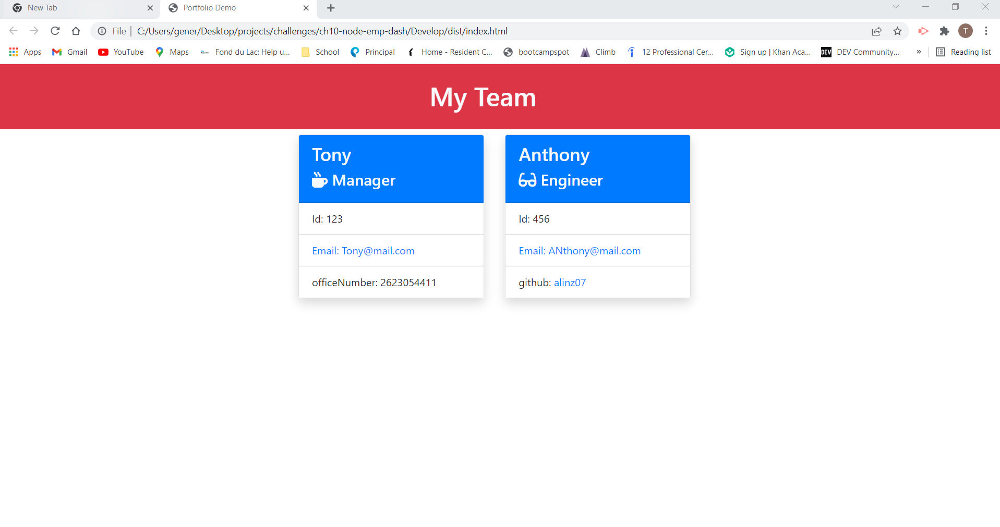

# Node Employee Dashboard
 

## **Link** to video walkthrough to demonstrate app functionality: https://drive.google.com/file/d/1g35sQWTip0CyGE0N5PG32CVwBRcClzM_/view?usp=sharing 
## **Link** to project repository: https://github.com/alinz07/ch10-node-emp-dash 

## **Link** to a sample html file generated by the application: https://alinz07.github.io/ch10-node-emp-dash/  
 

## **Motivation**
Build a Node.js command-line application that takes in information about employees on a software engineering team and generates an HTML webpage that displays summaries for each person. Use unit tests to practice TDD.s

 

## **Table of Contents**
[How and Why?](#what-problem-does-this-solve-and-how-was-a-solution-accomplished)  
[Things I learned](#things-i-learned)  
[What makes this project stand out?](#what-makes-this-project-stand-out)  
[Challenge Criteria](#challenge-criteria) 
[Screenshot of Web Application](#screenshot-of-web-application) 
[How to Contribute](#how-to-contribute) 
[Credits](#credits) 
  
 

## **What Problem does this solve and how was a solution accomplished?**
This application avoids using the browser as the javascript runtime environment, and instead uses node. A Manager can enter information about employees, or keep an array of employees to add to, and quickly access key information like their email, employee id, role, name, etc.

The Inquirer node package gets input from users through the prompt method, and a library of javascript objects guide the question flow. I used another object, Input, to organize the order of execution of the app. You just type node index when in the Development folder and the Input object is initialized.

I used many imported/exported functions to modularize the code and keep the Input object function methods clean.

The Jest node package runs tests for each of the objects I created except for input, because the code is so complex and the employee objects are the ones that are transformed into HTML elements as the app output.
 

## **Things I learned**

* I learned a lot more about promises and using the .then() method. I previously thought you could use .then() to avoid
asynchronous functions, but .then() can only be used when returning a promise, like that returned from the inquirer prompt method.

* This app made the the value of TDD very apparent. When struggling to organize the flow of execution in the Input object file, I started over using the TDD method and it helped me organize my objects and write functions. These objects and functions were easier to manage in the higher level Input object afterwards.

* This app gave me a lot of practice creating and accessing object properties and values, which also came with practice reading documentation. I couldn't figure out how to access the class of a class instance object, so I just created a new property called role that had the same value.

 

## **What makes this project stand out?**

I'm proud of the flow of execution of the app using promises and their returns. The input object looks clean and is easy to understand. I'm also proud of the short css file, and that I was able to take advantage of bootstrap.
 

## **Challenge Criteria**
AS A manager
I WANT to generate a webpage that displays my team's basic info
SO THAT I have quick access to their emails and GitHub profiles

GIVEN a command-line application that accepts user input 

* WHEN I am prompted for my team members and their information 
THEN an HTML file is generated that displays a nicely formatted team roster based on user input

* WHEN I click on an email address in the HTML  
THEN my default email program opens and populates the TO field of the email with the address

* WHEN I click on the GitHub username  
THEN that GitHub profile opens in a new tab

* WHEN I start the application 
THEN I am prompted to enter the team manager’s name, employee ID, email address, and office number

* WHEN I enter the team manager’s name, employee ID, email address, and office number 
THEN I am presented with a menu with the option to add an engineer or an intern or to finish building my team

* WHEN I select the engineer option 
THEN I am prompted to enter the engineer’s name, ID, email, and GitHub username, and I am taken back to the menu

* WHEN I select the intern option 
THEN I am prompted to enter the intern’s name, ID, email, and school, and I am taken back to the menu

* WHEN I decide to finish building my team 
THEN I exit the application, and the HTML is generated

 

## **Screenshot of Web Application**

The example HTML dashboard file that is created with this app can be found in the Develop/dist folder and is named index.html
 

## **How to Contribute**
Please feel free to review, refactor and submit a pull request for additional features on my github page:  
https://github.com/alinz07 

### **Credits**
* None